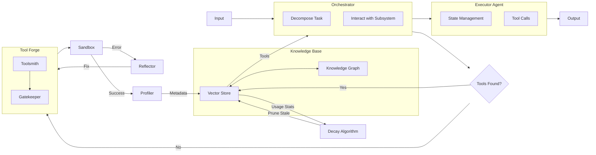
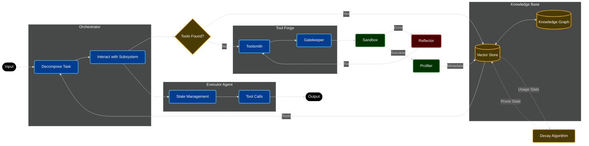
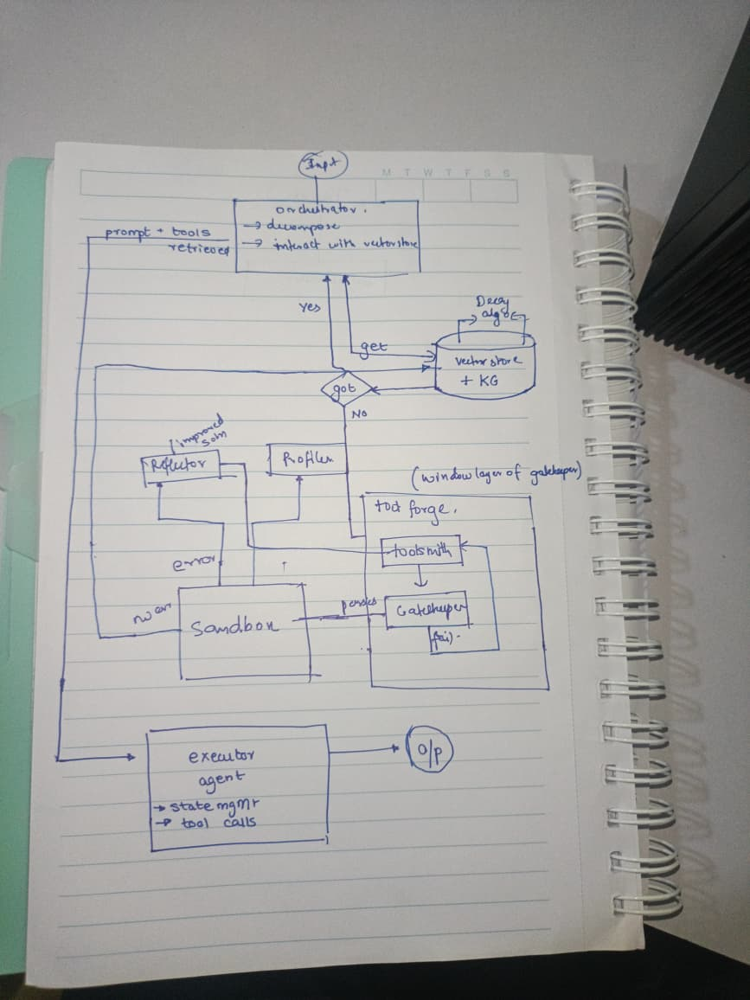

# IASCIS Architecture
**Independent Autonomous Self-Correcting Intelligent System**

```mermaid
flowchart LR
    Input["Input"] --> Orchestrator

    subgraph Orchestrator["Orchestrator"]
        O1["Decompose Task"]
        O2["Interact with Subsystem"]
    end

    Orchestrator --> Decision{Tools Found?}
    
    Decision -->|"Yes"| VectorStore
    Decision -->|"No"| ToolForge

    subgraph Storage["Knowledge Base"]
        direction TB
        VectorStore["Vector Store"]
        KG["Knowledge Graph"]
        VectorStore <--> KG
    end

    VectorStore -->|"Usage Stats"| Decay["Decay Algorithm"]
    Decay -->|"Prune Stale"| VectorStore

    subgraph ToolForge["Tool Forge"]
        direction TB
        Toolsmith["Toolsmith"]
        Gatekeeper["Gatekeeper"]
        Toolsmith --> Gatekeeper
    end

    ToolForge --> Sandbox["Sandbox"]

    Sandbox -->|"Error"| Reflector["Reflector"]
    Reflector -->|"Fix"| ToolForge

    Sandbox -->|"Success"| Profiler["Profiler"]
    Profiler -->|"Metadata"| VectorStore

    VectorStore -->|"Tools"| Orchestrator
    Orchestrator --> ExecutorAgent

    subgraph ExecutorAgent["Executor Agent"]
        direction TB
        EA1["State Management"]
        EA2["Tool Calls"]
    end

    ExecutorAgent --> Output["Output"]
```

```mermaid
%%{init: {'theme': 'dark', 'themeVariables': { 'darkMode': true }}}%%
flowchart LR
    %% --- Dark Mode Styling Definitions ---
    %% Default: Dark Gray background, Light Gray border, White text
    classDef default fill:#2d2d2d,stroke:#b0b0b0,stroke-width:1px,color:#fff;
    
    %% Logic: Dark Blue fill, Cyan border
    classDef logic fill:#003c8f,stroke:#4fc3f7,stroke-width:2px,rx:5,ry:5,color:#fff;
    
    %% Storage: Dark Brown/Orange fill, Gold border
    classDef storage fill:#4a3b00,stroke:#ffb300,stroke-width:2px,rx:5,ry:5,color:#fff;
    
    %% Action: Dark Green fill, Bright Green border
    classDef action fill:#003300,stroke:#66bb6a,stroke-width:2px,rx:5,ry:5,color:#fff;
    
    %% Error: Dark Red fill, Pink border
    classDef error fill:#4a0000,stroke:#ef5350,stroke-width:2px,rx:5,ry:5,color:#fff;
    
    %% Terminal: Black fill, White border
    classDef terminal fill:#000000,stroke:#fff,stroke-width:2px,color:#fff,rx:10,ry:10;

    %% --- Graph Content ---
    Input([Input]) --> O1

    subgraph Orchestrator ["Orchestrator"]
        direction TB
        O1["Decompose Task"]
        O2["Interact with Subsystem"]
        O1 --> O2
    end

    O2 --> Decision{Tools Found?}
    
    Decision -->|"Yes"| VectorStore
    Decision -->|"No"| Toolsmith

    subgraph Storage ["Knowledge Base"]
        direction TB
        VectorStore[("Vector Store")]
        KG[("Knowledge Graph")]
        VectorStore <--> KG
    end

    VectorStore -.->|"Usage Stats"| Decay["Decay Algorithm"]
    Decay -.->|"Prune Stale"| VectorStore

    subgraph ToolForge ["Tool Forge"]
        direction TB
        Toolsmith["Toolsmith"]
        Gatekeeper["Gatekeeper"]
        Toolsmith --> Gatekeeper
    end

    Gatekeeper --> Sandbox["Sandbox"]

    Sandbox -->|"Error"| Reflector["Reflector"]
    Reflector -->|"Fix"| Toolsmith

    Sandbox -->|"Success"| Profiler["Profiler"]
    Profiler -->|"Metadata"| VectorStore

    VectorStore -->|"Tools"| O1
    O2 --> EA1

    subgraph ExecutorAgent ["Executor Agent"]
        direction TB
        EA1["State Management"]
        EA2["Tool Calls"]
        EA1 --> EA2
    end

    EA2 --> Output([Output])

    %% --- Class Assignments ---
    class Input,Output terminal;
    class O1,O2,EA1,EA2,Toolsmith,Gatekeeper logic;
    class VectorStore,KG,Decay storage;
    class Sandbox,Profiler action;
    class Reflector error;
    class Decision storage;
```

