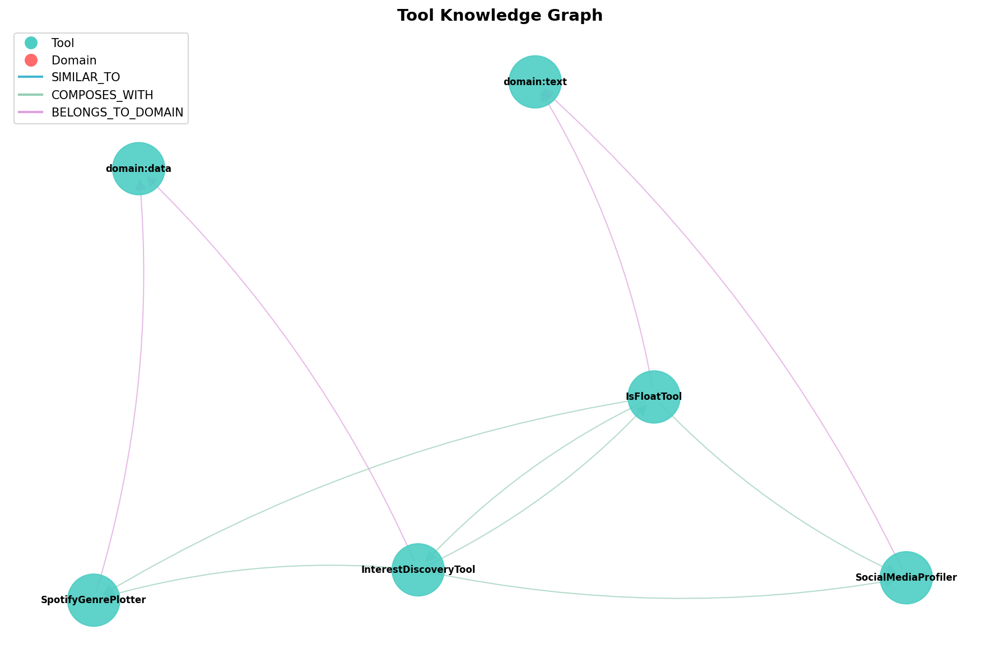

# IASCIS — Independent Autonomous Self-Correcting Intelligent System

An autonomous, self-correcting multi-agent system that **dynamically creates, profiles, and manages its own tools** — executing them inside Docker sandboxes, discovering them via semantic embeddings + knowledge graphs, and self-healing through reflection loops. Give it a natural-language task; it decomposes, retrieves (or generates) the right tools, executes, profiles, and returns results.

---

## Architecture


### Tool Knowledge Graph

> Generated by `architecture/visualise_graph.py` — tools clustered by domain with similarity and composability edges.



### Flow

1. **Input** — User query enters the system; `InputLoader` attaches any documents/images from `workspace/inputs/`.
2. **Routing** — `Dispatcher` classifies the query as PUBLIC or PRIVATE (sensitive-data detection). `IntentClassifier` maps it to a domain (math, web, data, visualization, conversion, search, etc.) without calling an LLM.
3. **Classification** — `Orchestrator` asks the LLM: _"Is this a DIRECT_RESPONSE or a COMPLEX_TASK?"_ Simple factual questions are answered directly; everything else is decomposed.
4. **Decomposition** — The LLM breaks the query into ordered `SubTask` objects, each tagged with a domain and expected I/O types.
5. **Tool Retrieval** — `ToolRetriever` runs a hybrid search: FAISS semantic similarity (via `ToolEmbedder`) + `ToolGraph` expansion (Jaccard tag similarity + output→input composability edges). Priority routing shortcuts exist for known domains (search, slides, equations, QR, TTS, cron, mermaid, document conversion).
6. **Tool Generation** — If no tool matches, `Toolsmith` generates one: the LLM writes a Python tool class, `Gatekeeper` validates it (AST analysis + SAST vulnerability scanning), and it is saved to `workspace/tools/` and registered in `registry.json`.
7. **Execution** — `ExecutorAgent` iterates through the `ExecutionPlan`. Each tool runs inside a persistent **Docker container** (`python:3.11-slim`). The `Sandbox` auto-detects imports, filters stdlib, maps aliases (e.g. `PIL` → `Pillow`, `cv2` → `opencv-python`), and pip-installs dependencies.
8. **Profiling** — `Profiler` captures wall time, peak memory, memory delta, CPU utilization, and efficiency scores. Results feed into `ToolDecay` to deprioritize slow/stale tools over time.
9. **Self-Correction** — On failure, `Reflector` pattern-matches the error (syntax, runtime, import, timeout, etc.), diagnoses the root cause, generates a corrective prompt, and hands back to the executor for automatic retry (up to 3 attempts).

---

## Tool Inventory

**38 registered tools** across 42 Python files in `workspace/tools/`, spanning:

| Category           | Example Tools                                                      |
| ------------------ | ------------------------------------------------------------------ |
| **Search / Web**   | SerpSearchTool, WebScraperTool, HackerNewsTool                     |
| **GitHub**         | GitHubProfileSearchTool, GitHubTrendingTool, GitHubRepoTool        |
| **Social**         | RedditTool, RedditSentimentAnalyzerTool, ProductHuntSearchTool     |
| **Finance**        | StockPriceTool, CurrencyConverterTool                              |
| **Data / Viz**     | AdvancedGraphTool, SalesDataAnalyzer, TableParserTool              |
| **Visualization**  | MermaidDiagramTool, MarkdownMindmapTool, QRCodeGeneratorTool       |
| **Documents**      | SlideDeckGeneratorTool, DocumentConverterTool (PDF↔LaTeX↔Markdown) |
| **Math / Science** | LatexEquationRendererTool (LLM-powered LaTeX conversion)           |
| **Audio**          | AudioSummaryTool (gTTS text-to-speech)                             |
| **System**         | CronReminderTool (NL→cron + .ics generation)                       |
| **Academic**       | BibliographyCreator, ExtractCitationsTool, SimilarPapersTool       |
| **Weather / Geo**  | WeatherForecastTool, RoutePlannerTool                              |

New tools are generated on-the-fly when the system encounters a task with no matching tool.

---

## Project Structure

```
agentic_system/
├── main.py                     # Entry point — IASCIS class + CLI
├── pyproject.toml              # Dependencies (uv)
│
├── architecture/               # Core agent subsystems
│   ├── orchestrator.py         # Decompose → retrieve → plan → execute
│   ├── executor.py             # Step runner with profiling & retries
│   ├── sandbox.py              # Docker container lifecycle & dep install
│   ├── toolsmith.py            # LLM-powered tool generator
│   ├── gatekeeper.py           # AST + SAST safety validation
│   ├── reflector.py            # Error diagnosis & self-correction
│   ├── dispatcher.py           # PUBLIC / PRIVATE zone routing
│   ├── intent_classifier.py    # LLM-free domain classification
│   ├── tool_retriever.py       # FAISS semantic + graph-based retrieval
│   ├── tool_embedder.py        # SentenceTransformer → FAISS index
│   ├── tool_graph.py           # NetworkX knowledge graph of tools
│   ├── profiler.py             # Multi-mode perf profiling
│   ├── llm_manager.py          # Multi-provider LLM (LiteLLM + key rotation)
│   ├── api_registry.py         # Free public API catalog for Toolsmith
│   ├── schemas.py              # Pydantic models (SubTask, ExecutionPlan, …)
│   ├── prompts.py              # System prompt templates
│   └── visualise_graph.py      # Tool graph renderer
│
├── workspace/
│   ├── tools/                  # Generated tool .py files + registry.json
│   ├── inputs/                 # Drop documents / images here for context
│   └── output/                 # Tool outputs (images, HTML, MP3, ICS, …)
│
├── benchmark/                  # Benchmark runner & visualization
│   ├── benchmark.py
│   ├── metrics_collector.py
│   └── visualize.py
│
├── logs/                       # Profiler JSON exports
├── docs/                       # Accomplished tasks & performance stats
└── utils/                      # Logger, helpers
```

---

## Setup

### Prerequisites

- **Python 3.13+**
- **[uv](https://docs.astral.sh/uv/)** — fast Python package manager
- **Docker** — running daemon (tools execute inside `python:3.11-slim` containers)

### Install

```bash
uv sync
```

### Environment Variables

Create a `.env` file in the project root:

```env
# Required — at least one LLM provider
GROQ_API_KEY=gsk_...            # Primary (Groq llama-3.3-70b-versatile)

# Optional — additional providers (LLMManager rotates keys)
GEMINI_API_KEY=...
OPENAI_API_KEY=...
ANTHROPIC_API_KEY=...

# Optional — for SerpSearchTool web search
SERP_API_KEY=...
```

---

## Usage

### Interactive Mode

```bash
uv run main.py
```

You will be prompted to enter a task in natural language. Examples:

```
Enter your task: Render the quadratic formula as an image
Enter your task: Generate a QR code for https://github.com
Enter your task: Create a presentation about transformer architecture
Enter your task: Convert 500 USD to INR
Enter your task: Remind me to check arXiv every Monday at 9am
Enter your task: Fetch GitHub star counts for 10 repos and plot growth
```

### Document Context

Drop files (PDF, images, CSV, etc.) into `workspace/inputs/` before running. IASCIS will automatically detect and inject them as context for your query.

### Programmatic

```python
from main import IASCIS

with IASCIS(enable_profiling=True) as system:
    result = system.run("Scrape top HackerNews posts and summarize them")
    print(result["result"])

    # With self-correction (up to 3 retries)
    result = system.run_with_reflection("Plot stock prices for AAPL vs GOOGL")
```

### Benchmarks

```bash
uv run python -m benchmark.benchmark              # Full IASCIS pipeline
uv run python -m benchmark.benchmark --mode no_decomp  # Skip decomposition
uv run python -m benchmark.benchmark --mode raw_llm    # Raw LLM baseline
uv run python -m benchmark.visualize              # Generate charts
```

---

## Key Design Patterns

| Pattern                        | Implementation                                                                                                                                                                                            |
| ------------------------------ | --------------------------------------------------------------------------------------------------------------------------------------------------------------------------------------------------------- |
| **Docker Sandboxing**          | Every tool runs in an isolated container. The Sandbox auto-detects PyPI imports (filtering stdlib), maps aliases (`PIL`→`Pillow`, `cv2`→`opencv-python`, `fitz`→`pymupdf`), and installs deps at startup. |
| **Embedding-Based Retrieval**  | Tool metadata is embedded with `all-MiniLM-L6-v2` into a FAISS index. Queries are matched by cosine similarity with graph-based expansion.                                                                |
| **Knowledge Graph**            | A NetworkX `DiGraph` encodes tool relationships — Jaccard tag similarity edges and output→input type composability edges enable multi-tool pipeline discovery.                                            |
| **On-the-Fly Tool Generation** | When no tool matches a subtask, Toolsmith LLM-generates one, Gatekeeper validates it (3-layer: AST + SAST + risk scoring), and it's registered immediately.                                               |
| **Self-Correction Loop**       | Reflector classifies errors, diagnoses root causes, and generates corrective prompts for automatic retries (up to 3 attempts).                                                                            |
| **Multi-Mode Profiling**       | Five tiers (OFF → LIGHTWEIGHT → STANDARD → FULL → GPU) capturing wall time, peak memory, CPU, I/O, and cProfile bottlenecks. Feeds tool decay scoring.                                                    |
| **Privacy-Aware Routing**      | Dispatcher inspects queries for sensitive patterns (API keys, credentials, PII) and routes to private or public execution zones.                                                                          |
| **Multi-Provider LLM**         | LiteLLM abstraction over Groq, Gemini, OpenAI, Anthropic with round-robin API key rotation (up to 15 keys per provider).                                                                                  |
| **Priority Routing**           | Known task types (search, slides, equations, QR codes, TTS, cron, diagrams, document conversion) are shortcut-routed before falling back to semantic retrieval.                                           |

---

## Performance Snapshot

> From 91 successful runs across 39 curated tasks (see [`docs/accomplished_tasks`](docs/accomplished_tasks))

| Metric         | Value                                                     |
| -------------- | --------------------------------------------------------- |
| Avg total time | ~10.5s                                                    |
| Min time       | 4.35s (currency conversion)                               |
| Max time       | 22.17s (multi-step web scraping)                          |
| Tool grades    | 7 fast (<10ms) · 7 moderate · 15 slow · 14 critical (>1s) |

---

## License

MIT
