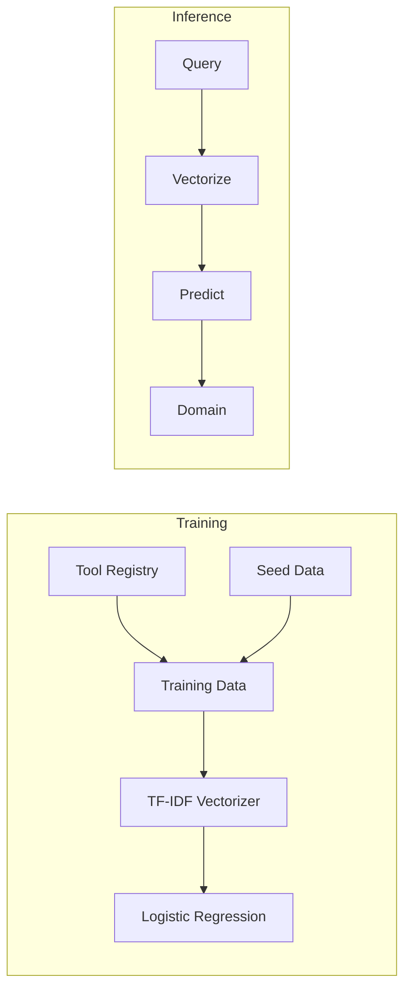
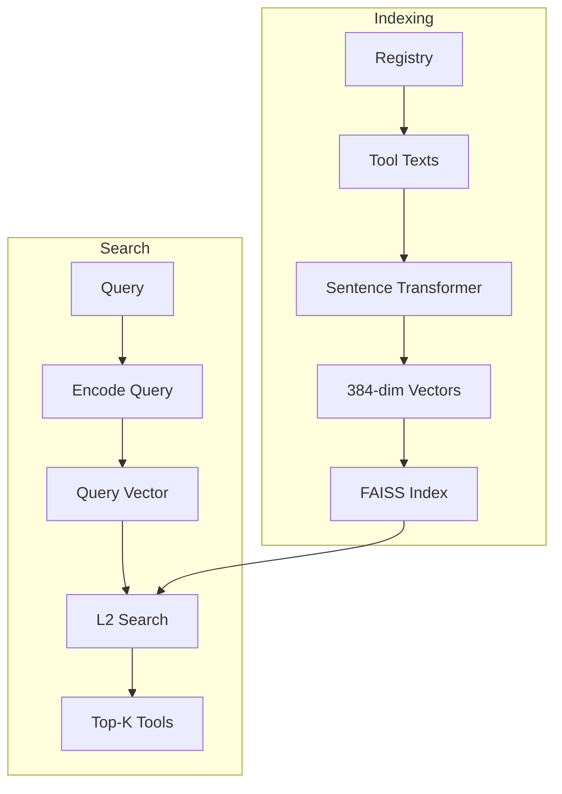
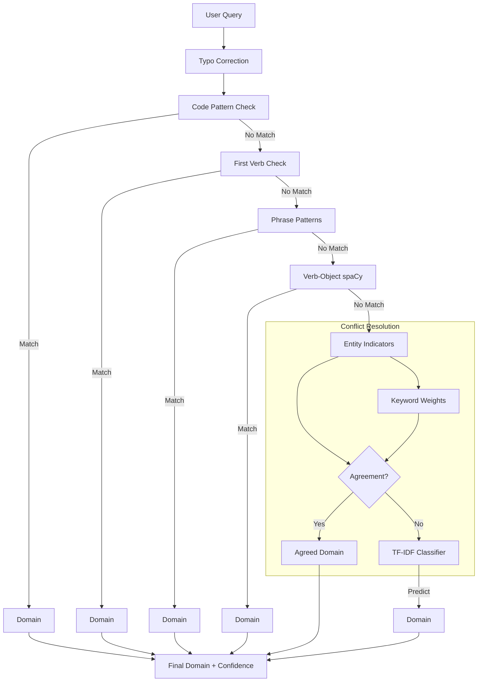

# Machine Learning Models in IASCIS

This document explains the ML/AI components used in the IASCIS system for intelligent decision-making.

---

## Overview

IASCIS uses **two distinct ML approaches**:

| Component            | Model Type                    | Library                      | Purpose                         |
| -------------------- | ----------------------------- | ---------------------------- | ------------------------------- |
| **IntentClassifier** | TF-IDF + Logistic Regression  | scikit-learn                 | Domain classification for tools |
| **ToolEmbedder**     | Sentence Transformers + FAISS | sentence-transformers, faiss | Semantic tool search            |

Both are **traditional ML models**, not deep learning LLMs. The LLMs (Gemini, Ollama) are used for code generation and planning, while these models handle fast, local classification and search.

---

## 1. Intent Classifier (TF-IDF + Logistic Regression)

**File:** [intent_classifier.py](file:///Users/karan/Desktop/Projects/Research/agentic_system/architecture/intent_classifier.py)

### What It Does

Classifies natural language queries into one of 10 tool domains:
- `math`, `text`, `file`, `web`, `data`, `visualization`, `conversion`, `validation`, `search`, `system`

### The ML Pipeline



### How TF-IDF Works

**TF-IDF (Term Frequency-Inverse Document Frequency)** converts text into numerical vectors:

```
TF-IDF(word, document) = TF(word, document) × IDF(word)

Where:
- TF = How often the word appears in this document
- IDF = log(Total documents / Documents containing this word)
```

**Example:**
```
Query: "calculate the factorial of a number"

TF-IDF converts this to a 500-dimensional vector where:
- "factorial" → high weight (rare, domain-specific)
- "the" → low weight (common, filtered by stop_words)
- "calculate" → medium weight (action verb)
```

### Training Data

The classifier is trained on two data sources:

#### 1. Seed Data (Built-in, ~350 samples)
```python
seed_data = {
    "math": [
        "calculate factorial prime number arithmetic sum multiply divide square root equation",
        "compute average mean median mode standard deviation log integral derivative",
        # ... replicated 5x for weight
    ] * 5,
    "text": [...] * 5,
    # ... all 10 domains
}
```

Each domain has ~7 example sentences × 5 replications = ~35 samples per domain.

#### 2. Registry Data (Dynamic)
```python
for tool_name, meta in self.registry.items():
    text = f"{description} {tags} {input_types} {output_types}"
    texts.append(text)
    domains.append(meta["domain"])
```

### The Model

```python
from sklearn.feature_extraction.text import TfidfVectorizer
from sklearn.linear_model import LogisticRegression

# Vectorizer: converts text → 500-dim vectors
self.tfidf_vectorizer = TfidfVectorizer(max_features=500, stop_words='english')
X = self.tfidf_vectorizer.fit_transform(texts)

# Classifier: logistic regression with one-vs-rest for multi-class
self.tfidf_classifier = LogisticRegression(max_iter=200)
self.tfidf_classifier.fit(X, y)
```

**Why Logistic Regression?**
- Fast training and inference
- Works well with sparse TF-IDF vectors
- Interpretable probabilities
- No GPU required

### Inference Flow

```python
def _classify_by_tfidf(self, query: str) -> Optional[str]:
    # 1. Transform query to TF-IDF vector
    X = self.tfidf_vectorizer.transform([query])
    
    # 2. Predict domain
    prediction = self.tfidf_classifier.predict(X)
    
    # 3. Decode label
    return self.label_encoder.inverse_transform(prediction)[0]
```

### Multi-Tier Classification

TF-IDF is actually the **fallback** method. The classifier uses a priority cascade:

```python
def classify(self, query: str) -> Tuple[str, str, float]:
    # Priority 1: Code patterns (pd., np., plt.)
    # Priority 2: First-verb rules ("download X" → web)
    # Priority 3: Phrase patterns (regex matching)
    # Priority 4: Verb-object patterns (spaCy NLP)
    # Priority 5: Entity indicators (keyword sets)
    # Priority 6: Weighted keywords (manual weights)
    # Priority 7: TF-IDF classifier ← HERE
    # Priority 8: Low-confidence keyword fallback
```

**Why the cascade?**
- Rule-based methods are faster and more interpretable
- TF-IDF handles ambiguous cases that rules miss
- Confidence scores allow informed decisions

---

## 2. Tool Embedder (Sentence Transformers + FAISS)

**File:** [tool_embedder.py](file:///Users/karan/Desktop/Projects/Research/agentic_system/architecture/tool_embedder.py)

### What It Does

Enables **semantic search** over tools - find tools by meaning, not just keywords.

### The ML Pipeline



### Sentence Transformer Model

```python
from sentence_transformers import SentenceTransformer

self.model = SentenceTransformer('all-MiniLM-L6-v2')
```

**Model: `all-MiniLM-L6-v2`**
- Architecture: 6-layer MiniLM (distilled from BERT)
- Embedding dimension: 384
- Speed: ~14,000 sentences/sec on CPU
- Size: ~80MB

**How it works:**
1. Tokenize text into subwords
2. Pass through transformer layers
3. Pool outputs into single 384-dim vector
4. Vectors capture semantic meaning

### Building the Index

```python
def build_index(self, registry: dict):
    # 1. Create text representations for each tool
    texts = [build_embedding_text(name, registry[name]) for name in self.tool_names]
    
    # 2. Encode all tools to vectors
    embeddings = self.model.encode(texts, convert_to_numpy=True)
    
    # 3. Build FAISS index for fast similarity search
    dimension = embeddings.shape[1]  # 384
    self.index = faiss.IndexFlatL2(dimension)
    self.index.add(embeddings.astype('float32'))
```

**Text representation for each tool:**
```python
def build_embedding_text(tool_name: str, tool_data: dict) -> str:
    return f"name:{name} description:{description} tags:{tags} domain:{domain} inputs:{inputs} outputs:{outputs}"
```

### FAISS Search

**FAISS (Facebook AI Similarity Search)** enables fast nearest-neighbor lookup:

```python
def search(self, query: str, top_k: int = 3) -> list:
    # 1. Encode query
    query_embedding = self.model.encode([query], convert_to_numpy=True)
    
    # 2. Find k nearest neighbors by L2 distance
    distances, indices = self.index.search(query_embedding, top_k)
    
    # 3. Return tool names and distances
    return [{'tool': self.tool_names[idx], 'distance': dist} for ...]
```

**L2 Distance (Euclidean):**
```
distance = sqrt(Σ(a_i - b_i)²)

Lower distance = more similar
```

### Why Semantic Search?

**Keyword search fails for:**
```
Query: "find my interests from social media"
Keywords: interests, social, media

But the tool is called "ProfileAnalyzer" with description 
"analyze user preferences from online profiles"
```

**Semantic search succeeds** because the embeddings capture:
- "interests" ≈ "preferences"
- "social media" ≈ "online profiles"
- "find" ≈ "analyze"

---

## 3. How They Work Together

The **ToolRetriever** combines both approaches:

```python
class ToolRetriever:
    def __init__(self, registry_path: str):
        self.registry = load_registry(registry_path)
        self.graph = build_tool_graph(self.registry)     # Graph relationships
        self.embedder = ToolEmbedder()                   # Semantic search
        self.embedder.build_index(self.registry)
    
    def retrieve(self, query: str, top_k: int = 3, expand: bool = True) -> dict:
        # 1. Semantic search for primary matches
        semantic_results = self.embedder.search(query, top_k)
        
        # 2. Expand with graph-based similar tools
        for tool in semantic_results:
            similar = get_similar_tools(self.graph, tool)
            composable = get_composable_tools(self.graph, tool)
        
        return {
            'primary_tools': semantic_results,
            'similar_tools': similar,
            'composable_tools': composable
        }
```

---

## 4. Comparison: TF-IDF vs Embeddings

| Aspect       | TF-IDF + LogReg                  | Sentence Transformer     |
| ------------ | -------------------------------- | ------------------------ |
| **Task**     | Classification (1 of 10 domains) | Search (find similar)    |
| **Output**   | Domain label                     | Ranked tool list         |
| **Speed**    | Faster (~μs)                     | Slower (~ms)             |
| **Semantic** | Keyword-based                    | True semantic similarity |
| **Training** | Needs labeled data               | Pre-trained (zero-shot)  |
| **Memory**   | ~1MB                             | ~80MB model + index      |

---

## 5. Complete Classification Flow



---

## 6. Model Files & Dependencies

### Dependencies
```toml
# pyproject.toml
dependencies = [
    "scikit-learn",           # TF-IDF + LogReg
    "sentence-transformers",  # Embeddings
    "faiss-cpu",              # Vector search
    "spacy",                  # NLP parsing
]
```

### Pretrained Models Downloaded
```
~/.cache/huggingface/
└── hub/
    └── models--sentence-transformers--all-MiniLM-L6-v2/
        ├── config.json
        ├── pytorch_model.bin (~80MB)
        └── tokenizer.json

# spaCy model (optional)
python -m spacy download en_core_web_sm
```

---

## 7. Performance Characteristics

| Operation                 | Time  | Memory             |
| ------------------------- | ----- | ------------------ |
| TF-IDF vectorization      | ~10μs | ~1MB               |
| LogReg prediction         | ~5μs  | Negligible         |
| Sentence encoding         | ~10ms | ~200MB (inference) |
| FAISS search (1000 tools) | ~1ms  | ~1.5MB index       |
| spaCy parsing             | ~5ms  | ~50MB              |

**Total classification time:** ~15-20ms (with all methods)

---

## Summary

IASCIS uses **lightweight, traditional ML** for speed-critical decisions:

1. **TF-IDF + Logistic Regression**: Fast domain classification with interpretable confidence scores
2. **Sentence Transformers + FAISS**: Semantic tool search when exact keyword matching fails

Both run locally without GPU, enabling fast (<20ms) classification while reserving LLM calls for complex generation tasks.